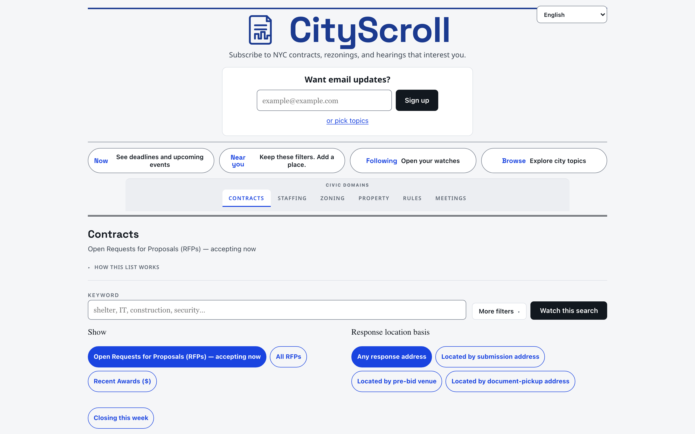
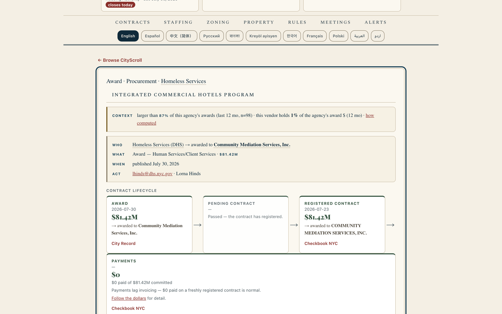
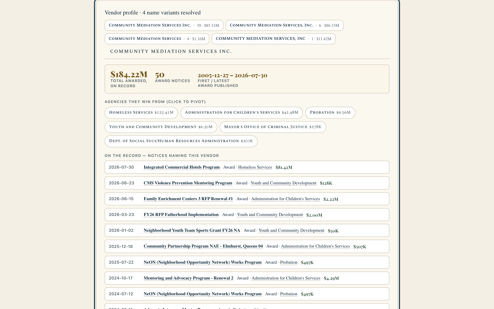
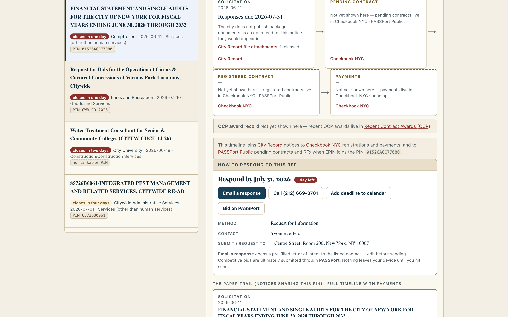
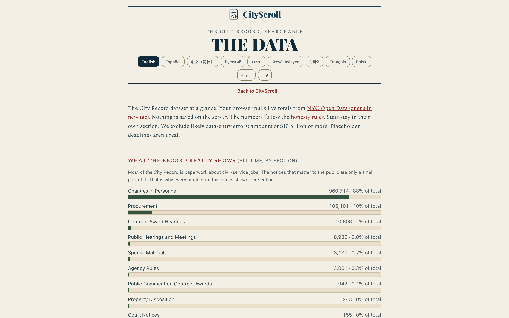

# CityScroll

CityScroll brings New York City's scattered public-data systems into one place — and
**links the same real-world objects across them**. Follow a procurement from solicitation
through payment, walk a rezoning through its phases, open the next step on a live RFP, and
get an email the morning something you care about appears. No single city website connects
these threads. CityScroll does.

*   **Use it:** [cityscroll.org](https://cityscroll.org/)
*   **About:** [cityscroll.org/about.html](https://cityscroll.org/about.html)
*   **System Stats:** [cityscroll.org/stats.html](https://cityscroll.org/stats.html)



[**Open it →**](https://cityscroll.org/)

---

## Best of the best — cross-domain and actionable

CityScroll’s edge is not a longer list of datasets. It is **connecting the same real-world
objects across domains** and turning that graph into **something you can do now**: respond,
testify, follow money, track a process, or get alerted. The capabilities below score highest
on that axis — cross-domain × real actionability. Examples point at shipping product URLs on
[cityscroll.org](https://cityscroll.org/).

### 1. Cross-domain civic intelligence — one agency across money, land, rules, and meetings

Agency profiles are more than a City Record notice list. A linked-object panel groups
**contracts and awards, rezonings and tax-lot projects, rulemakings, and hearings** for the
same agency — each object named, dated when known, and stamped with source provenance so you
can see *why* it is linked. District context, vendor links, and meeting outcomes stay connected
when the source graph has enough confidence.

This is the product’s clearest “one real-world organization, every domain it touches”
surface — the scatter of Open Data portals does not offer it.

**Live example:** [Parks and Recreation](https://cityscroll.org/#agency/Parks%20and%20Recreation)
(agency profile with multi-domain linked objects when the materialization covers that agency).

Related: pivot from any notice to the [vendor](https://cityscroll.org/#vendor/Community%20Mediation%20Services%2C%20Inc.)
or agency named on it; notice pages also treat notice ↔ PIN ↔ registered contract as linked
objects so the procurement story stays one object, not four browser tabs.

### 2. Next steps extracted — not “see the official notice”

When something is actionable, CityScroll leads with **what to do**, parsed from the ingested
notice and joined portals:

*   **Open solicitations** open with a **“What can I do now?”** rail: due date, method,
    contacts, package/submit URL when the body publishes one, and a PASSPort RFx deep link
    when the EPIN joins — never a vague “use the response instructions in the notice.”
*   **Public hearings** open with **how to participate**: venue, online join when published,
    testimony email and cutoff when the body states them, and contact lines — not an empty
    “no online link” dead end when the notice already printed the steps.

**Live examples:**

*   [Bus transportation for DHS shelter clients](https://cityscroll.org/#notice/20260629024)
    (solicitation rail + PASSPort RFx when joined)
*   [Parks concession hearing with participation steps](https://cityscroll.org/#notice/20260716022)

Browse more open RFPs: [Money · open solicitations closing this week](https://cityscroll.org/#money?mode=open&closing=week)

### 3. Phase-grouped timelines and predictions — dense civic histories with explicit uncertainty

Long paper trails collapse onto **canonical phase walls** instead of a flat milestone dump:

*   **Money:** Solicitation → Selection → Award and registration → Payments, with repeated
    links deduped and verbatim-repeated milestones aggregated. Action-first on the current
    phase; earlier phases under disclosure.
*   **Land (ULURP-oriented):** pre-application through community board, Borough President,
    City Planning Commission, Council, and mayoral/appeals — over a ZAP + City Record event spine.
*   **PIN matter pages:** every City Record stage that shares the identifier, plus Checkbook
    registration and paid-to-date, under the same procurement phases so multi-year renewals
    read as one contract story.
*   **Predictions:** statutory and lifecycle predictions are shown with method and confidence
    labels (for example, ULURP statutory clocks and contract-renewal forecasts), never as certain
    outcomes.

**Live examples:**

*   [Award paper trail with payments](https://cityscroll.org/#notice/20240723114)
    (`?focus=follow-the-dollars` jumps to paid-to-date)
*   [Recent award side-car + vendor links](https://cityscroll.org/#notice/20260724018)
*   [21st Avenue bridge engineering · PIN `84124P0003001`](https://cityscroll.org/#matter/84124P0003001)
*   [Timbale Terrace rezoning (`2022M0258`)](https://cityscroll.org/#land/2022M0258)

[](https://cityscroll.org/#notice/20260724018)

### 4. Follow the money across systems that don’t link to each other

A single notice joins the **City Record** announcement, **Checkbook NYC** registration and
paid-to-date, **PASSPort** contract detail when present, and **OCP** award corroboration —
every source named. When publishers disagree on amount or date, **both values stay visible**
as labeled assertions, not a silently chosen “winner.”

**Live example:** [Award with registration + payments joined](https://cityscroll.org/#notice/20240723114)

### 5. Entity-linked vendors and agencies — one object across every mention

Vendor profiles resolve name variants (punctuation, casing, legal suffixes), total awards
across agencies, list every notice that names the firm, and attach **Doing Business Search**
identity when the organization stem matches. That is the money-side counterpart to
cross-domain agency intelligence: identity first, then every published trail.

**Live example:** [Community Mediation Services](https://cityscroll.org/#vendor/Community%20Mediation%20Services%2C%20Inc.)
(~$184M across 50 awards and six agencies; four published name variants).

[](https://cityscroll.org/#vendor/Community%20Mediation%20Services%2C%20Inc.)

### 6. District-aware maps and filters — same decision context by place

District boundaries come from committed geometry layers, then every matching domain view applies
the same place filters without repeated live geocoding:

*   **Land and property:** district-first discovery for ULURP, disposition, and map-based route
    entry points.
*   **Meetings and alerts:** hearing and notice workflows can stay in the same district slice as you
    navigate between timeline, alert, and profile routes.
*   **Map-first workflow:** address search, neighborhood filters, and BBL-driven views stay in one
    source-of-truth location frame.

### 7. Hearings that answer “what was decided?”

Council hearing notices join **Legistar** agenda trees: matters, actions, votes, and
attachments on a matter-centric outcomes view. Non-Council hearings keep the process spine
the city actually publishes (notice → hearing) and name real landings for outcomes when no
citywide machine feed exists — never a fake vote.

**Live example:** [Council hearing with matched agenda → matter → vote spine](https://cityscroll.org/#notice/20260706036)

### 8. Rules comment windows while they are still open

Agency Rules notices carry a lifecycle spine enriched from the **NYC Rules** feed: proposal,
hearing, comment close, adoption, and effective dates — with official comment links when the
feed joins. Same “do something while the window is open” posture as solicitations and hearings.

**Live example:** [FHV / taxi parking rules · comment window](https://cityscroll.org/#notice/20260714029)

### 9. Morning digests when something you care about appears

Describe a watch in plain English (or build one on the Alerts tab), confirm via double
opt-in, and receive a morning email when new matches appear — in your chosen language.
Accounts with multiple watches get **one consolidated rollup**; preference-center edits take
effect on the next daily run.

*   [Build an alert](https://cityscroll.org/#alerts)
*   [Multi-watch rollup (demo surface)](https://cityscroll.org/#alerts?view=rollup)

[](https://cityscroll.org/#money)

### Honest about missing data

Empty lifecycle slots say **which kind of gap** they are: not yet joined from a public
source, or not published by the city at all — never a blank “unknown.” The
[API page](https://cityscroll.org/api.html) links the public delivery surfaces and
describes what feeds are live and how they are used.

[](https://cityscroll.org/api.html)

---

## What CityScroll covers

### Money (procurement)
Open RFPs, awards, and intermediate City Record stages (intent to negotiate / vendor list /
intent to award) on one timeline with Checkbook registration and payments, PASSPort RFx and
contracts, and OCP award corroboration. Export any view as CSV or Excel.

### Land use
Rezonings and land-use actions in plain English, linked to ZAP, tax-lot geometry, related
City Record notices, and a ULURP-oriented phase wall over the event spine (milestones,
dispositions, decision documents).

### Rules
Regulatory proposals and comment windows, enriched with official NYC Rules dates and links.

### Meetings
This week’s public hearings by borough or neighborhood. Council notices join Legistar
outcomes; participation steps are extracted from the notice when published. Other bodies
keep an honest process spine and real landing links.

### Property
Municipal asset auctions and disposition process spines joined by tax lot (BBL), with
parcel links when street geocode is missing.

### People (staffing)
Civil-service exams and hiring notices in one filterable list, with fee/salary when DCAS
published them, list-establishment depth, and an application → list → appointment process
spine on exam detail. Start at [Staffing](https://cityscroll.org/#people) or a concrete
exam such as [Caseworker `7016`](https://cityscroll.org/#exam/7016).

See the [civic lifecycle coverage inventory](docs/civic-lifecycle-coverage.md) for the
source, test, and live evidence behind the property, staffing, procurement, franchise,
and non-Council hearing timelines.

### Vendors and agencies
Deep-linkable profiles for vendors and agencies — name-variant resolution, award totals,
and notice lists. Agency profiles can surface **cross-domain linked objects** (money, land,
rules, meetings) with source provenance. When Checkbook term dates are available, profiles
and digests may show a **renewal outlook** row, clearly tagged as outlook rather than an
open solicitation.

---

## Search, alerts, and data tools

*   **Plain-English search:** Type what you’re looking for — “shelter services contracts,”
    “rezonings in Brooklyn,” “education contracts over $200K” — and CityScroll translates it
    into the right filters. Task entry points such as
    [Can I bid?](https://cityscroll.org/#task/can-i-bid) and
    [What will change near me?](https://cityscroll.org/#task/what-will-change) route first-time
    visitors into the right lens.
*   **Email digests:** Plain-English watches, double opt-in, morning delivery, multi-watch
    rollup, and a preference center. Subscribe-by-email is documented on the
    [API and feeds](https://cityscroll.org/api.html) page.
*   **Feeds:** Any saved search as **Atom** (`/feed.xml`), **JSON Feed** (`/feed.json`), or
    **calendar** (`/feed.ics`) on `api.cityscroll.org` — so you can wire CityScroll into your
    own tools.
*   **MCP for AI assistants:** Point any MCP client at `https://api.cityscroll.org/mcp`
    (`POST`, Streamable HTTP) to search notices programmatically
    ([API docs](https://cityscroll.org/api.html)).
*   **Multilingual:** Spanish, Simplified Chinese, Russian, and other languages via the
    header selector. Notice text stays in English (official record); unofficial translation
    is available on demand for shipping languages.
*   **Workspace:** Pin records, write local notes, export CSV/JSON dossiers, and generate
    shareable snapshot links. Digest links can restore a signed-in session so pins sync
    across devices.
*   **Exports:** Download any lens as Excel-safe CSV or a typed Excel workbook, export notice
    details with a contract-trail sheet, or print a clean permalink-stamped view to PDF.

---

## Data Sources

<!-- BEGIN GENERATED SOURCE CONTRACTS -->

The executable registry is [`site/data/source_contracts.json`](site/data/source_contracts.json);
[the generated source ledger](docs/data-sources.md) records coverage, cadence, freshness,
required fields, and known gaps. Required pull-request checks validate recorded upstream
shapes; a separate daily workflow runs the live verifier and reports publisher drift.

| Live source | Used for | Product freshness |
|---|---|---|
| [City Record Online](https://data.cityofnewyork.us/d/dg92-zbpx) `dg92-zbpx` | Core notices, feeds, alerts, profiles, hearings, property records, prior-cycle matches, attachment metadata, and aggregates. | Live browser queries use a five-minute cache; Worker mirrors and materialized views refresh daily. Attachment metadata uses document_links before 2025 and a polite host-side RequestDetail delta from 2025 onward because the exported column is empty in the modern era. |
| [NYCIDA/Build NYC subsidy project records](https://edc.nyc/about-nycedc/financial-public-documents-recordings) | City Record ↔ Build NYC subsidy timeline joins for application, hearing, board, closing, and compliance stages. | Worker fetches the EDC documents page and treats Cloudflare challenge HTML as a feed failure (notice-derived hearing fallback). Live monitor marks the landing as known bot-blocked for CI runners. |
| [Checkbook NYC registered contracts](https://www.checkbooknyc.com/data-feeds/api) `Contracts` | Pending and registered contract amounts, paid-to-date totals, contract terms, and the procurement lifecycle timeline. | Queried live for contract details and daily for watched renewal estimates. |
| [Checkbook NYC spending transactions](https://www.checkbooknyc.com/data-feeds/api) `Spending` | Individual payment records in the procurement lifecycle (solicitation to payment), joined via registered/pending contract ids. | Queried by contract_id after the Contracts-domain join (Checkbook Spending rejects PIN filters). |
| [Recent Contract Awards (OCP)](https://data.cityofnewyork.us/d/qyyg-4tf5) `qyyg-4tf5` | OCP award side-car on the procurement lifecycle: award date and amount corroboration against City Record, with both sources named when they disagree. | Joined into the precomputed contract lifecycle on the Worker; edge-cached with the lifecycle read model. |
| [NYS Authorities Budget Office — local authorities](https://data.ny.gov/d/8w5p-k45m) `8w5p-k45m` | Possible award matches for mapped local-authority profiles. | Checked weekly; the last good cache is retained if the upstream request fails. |
| [NYS Authorities Budget Office — local development corporations](https://data.ny.gov/d/d84c-dk28) `d84c-dk28` | Possible award matches for mapped local-development-corporation profiles. | Checked weekly; the last good cache is retained if the upstream request fails. |
| [NYS Authorities Budget Office — state authorities](https://data.ny.gov/d/ehig-g5x3) `ehig-g5x3` | Possible award matches for mapped state-authority profiles, including the MTA. | Checked weekly; the last good cache is retained if the upstream request fails. |
| [Citywide Payroll Data](https://data.cityofnewyork.us/d/k397-673e) `k397-673e` | Title and pay history in the Staffing experience. | Queried live with a five-minute browser cache. |
| [Civil Service List (Active)](https://data.cityofnewyork.us/d/vx8i-nprf) `vx8i-nprf` | Competitive-list checks, active-list totals, and post-list aggregate depth on exam cards (list_count and established dates only — never per-applicant rows). | Queried live for list checks; exam-level aggregates captured at build into data/exam_sources/civil_service_list_aggregates.json and joined onto staffing exam cards. |
| [Zoning Application Portal — projects](https://data.cityofnewyork.us/d/hgx4-8ukb) `hgx4-8ukb` | Rezoning search, status, milestones, applicants, and comments handoff. | Queried live with a five-minute browser cache and used by daily subscriptions. |
| [Zoning Application Portal — tax lots](https://data.cityofnewyork.us/d/2iga-a6mk) `2iga-a6mk` | Tax-lot joins from ZAP projects to MapPLUTO. | Queried live with a five-minute browser cache. |
| [Zoning Application Portal — project outcomes (Planning Labs API)](https://zap.planning.nyc.gov/) | Land detail decision documents, action approvals, disposition votes/recommendations, and DOB NOW tax-lot filing side-car beyond Open Data status chips. | Worker materializes per-project outcomes on GET /zap-outcomes with a one-day edge cache; the browser never calls the ZAP API for this panel. |
| [MapPLUTO](https://www.nyc.gov/content/planning/pages/resources/datasets/mappluto-pluto-change) | Tax-lot boundary geometry. | Queried live for matched ZAP tax lots. |
| [NYC GeoSearch](https://geosearch.planninglabs.nyc/) | Address, neighborhood, borough, and BBL resolution. | Queried live; the verifier checks availability and response shape, not underlying data age. |
| [DOB NOW job application filings](https://data.cityofnewyork.us/d/w9ak-ipjd) `w9ak-ipjd` | Current demolition-filing verification. | Queried live only when a demolition check is requested. |
| [Legacy DOB job application filings](https://data.cityofnewyork.us/d/ic3t-wcy2) `ic3t-wcy2` | Legacy demolition-filing verification. | Queried live as the fallback for demolition checks. |
| [Current Solicitations (OCP / Open Data)](https://data.cityofnewyork.us/d/3khw-qi8f) `3khw-qi8f` | Procurement lifecycle solicitation-stage enrichment: due dates and contact fields joined to City Record notices by request_id or PIN. Package document links when present (historical GetFile only on modern measurement); not a modern document source. | Joined at lifecycle compute time and cached with the procurement timeline in D1; a stale or unreachable view leaves City Record stages intact. Modern OCP rows do not fill package document_links (measured 0% for 2025+); historical GetFile links still surface when present. |
| [NYC Rules RSS feed](https://rules.cityofnewyork.us/) | Rule lifecycle enrichment: official comment/adoption page links, comment deadlines, hearing dates, adoption and effective dates joined to City Record Agency Rules notices. | Daily materialized join in the Worker; a stale or unreachable feed falls back to City Record notices only with an explicit enrichment-gap marker. |
| [NYC Council Legistar API](https://council.nyc.gov/legislation/api/) | Meeting outcomes surface: matching notices to Council agenda trees, matters, action outcomes, roll-call votes, attachments, and supporting documents. | Daily edge materialization (cron) fetches authenticated Events (180-day window), strict-joins City Record hearing notices, and materializes EventItems (agenda + matters + outcomes), best-effort roll-call votes, item attachments, and hearing documents (agenda/minutes PDFs) into the meeting-outcomes KV read model. Token reaches the Worker as secret LEGISTAR_API_TOKEN, synced idempotently from the GitHub Actions secret on each deploy. |
| [PASSPort Public contracts](https://a0333-passportpublic.nyc.gov/contracts.html) | Pending and pre-registration contract stages on the procurement lifecycle when Checkbook is unmatched, plus registered-stage enrichment when EPIN joins a City Record PIN. | Worker rebuilds the D1 passport_contracts table on the daily scheduled run; lifecycle reads join from that edge materialization with no live browser fetch to PASSPort. CI runners are bot-blocked from both the HTML landing and dataJs dumps; product freshness is the Worker’s daily D1 materialization. |
| [PASSPort Public solicitations (RFx)](https://a0333-passportpublic.nyc.gov/rfx.html) | RFx metadata on solicitation lifecycle stages (due date, method, status, commodity) joined by EPIN to City Record PINs. Package document URLs are not published on the public dataJs dump (measured 0% document-URL join); do not treat RFx as a package-doc source. | Worker rebuilds the D1 passport_rfx table on the daily scheduled run; solicitation lifecycle stages read joined RFx detail from that materialization. CI runners are bot-blocked from both the HTML landing and dataJs dumps; product freshness is the Worker’s daily D1 materialization. |
| [Doing Business Search - Entities](https://data.cityofnewyork.us/d/72mk-a8z7) `72mk-a8z7` | Vendor identity enrichment on vendor profiles: Doing Business Search listing, ownership structure, organization phone, and doing-business start date when organization_name stems match a City Record award vendor. | Worker re-fetches the full entity list during the daily vendor-profile rebuild and attaches stem-joined rows to matching profiles. Schema probes tolerate multi-month publisher lag via max_stale_days. |

The external-award registry currently maps 13 agency names to 12 distinct ABO authorities across `8w5p-k45m`, `d84c-dk28`, `ehig-g5x3`, adds 1 exact NYCHA mapping, and records 16 verified coverage gaps. ABO joins remain possible matches rather than exact contract identity.

MOCS Local Law 63 plan rows are disabled. The current official page publishes rotating
per-agency spreadsheets without a stable machine manifest; the former configured dataset is
non-tabular, and the former documented dataset does not exist. CityScroll does not show
official plan forecasts until a source passes the executable contract.

<!-- END GENERATED SOURCE CONTRACTS -->

---

## Under the hood

CityScroll is a two-part product:

*   **Static interface layer (`site/`)** for route, list, and page navigation.
*   **Cloudflare Worker layer (`worker/`)** for feeds, alerts, operator jobs, and materialized joins.

For implementation detail that moves, use live surfaces instead of README duplication:

*   [`docs/architecture.md`](docs/architecture.md): current code map, storage model, and service seams.
*   [System methodology and standards](standards.html): validation, gap taxonomy, and source-contract discipline.
*   [Methods and API entry points](api.html) and the generated source registry in
    [docs/data-sources.md](docs/data-sources.md).

The repository remains forkable for different jurisdictions; operational boundaries, runtime materialization
tiers, and provenance rules are versioned in the canonical docs above.

---

## Testing & Development

[](https://github.com/cityscroll/crol-list/actions/workflows/ci.yml)

Both unit layers run automatically in CI on every pull request and push to `main`
(`.github/workflows/ci.yml`); the Playwright functional suite runs on manual dispatch.

Run tests from the repository root:

*   **Unit Tests:** Run `node --test` to verify entity stem compilers, name resolution, and date logic.
*   **Worker Tests:** Run `node --test` inside the `worker/` directory.
*   **Functional (Playwright) Tests:** Driven against a headless Chromium browser using:
    ```bash
    ./test/functional/run.sh
    ```
    *Requires Python 3 and Playwright (`pip install playwright && playwright install chromium`).*
*   **Production E2E Tests:** Run the public demo-link contract against the canonical deployment using:
    ```bash
    CROL_BASE=https://cityscroll.org/ python3 test/functional/20_demo_links.py
    ```
