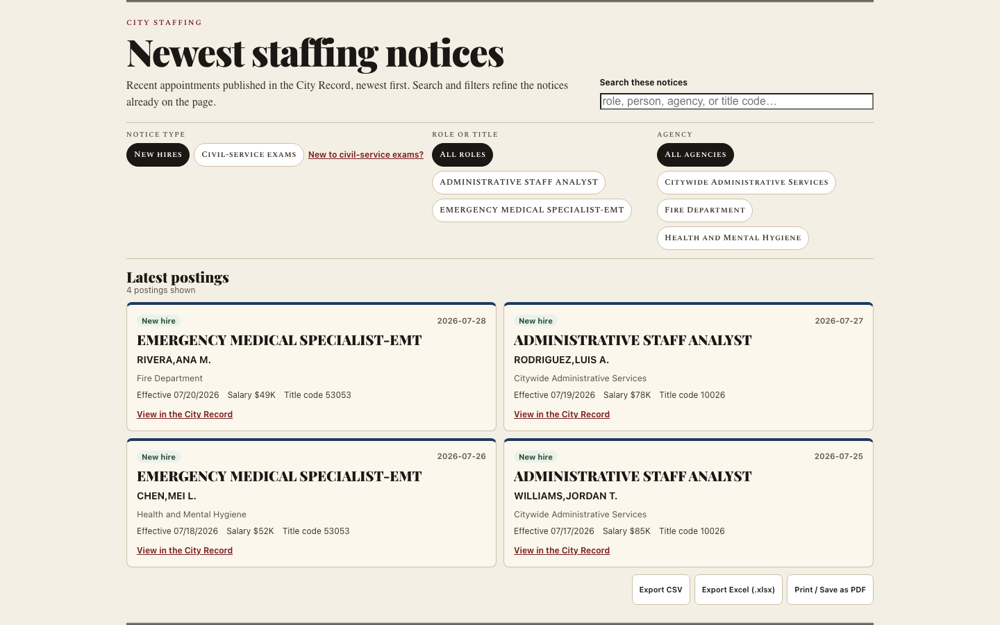

# CityScroll

CityScroll makes **The City Record** — the official daily journal where every NYC agency
must publish its contracts, hearings, rule changes, rezonings, and staff moves (NYC Charter
§1066) — actually searchable, and emails you the moment something you care about shows up
in it.

*   **Use it:** [cityscroll.org](https://cityscroll.org/)
*   **Changelog:** [cityscroll.org/changelog.html](https://cityscroll.org/changelog.html)
*   **System Stats:** [cityscroll.org/stats.html](https://cityscroll.org/stats.html)



---

## See it in action

**Track a rezoning in your neighborhood.**
*Before:* dig through City Planning's ZAP case portal by project number, or wait for a
neighborhood listserv to notice.
*With CityScroll:* search "Bushwick rezoning" in plain English, follow the project, and get
an email the moment its status changes — mapped against the actual tax lots.

**Catch a contract award before it's old news.**
*Before:* comb the City Record by hand, or wait for a reporter to flag it.
*With CityScroll:* watch any agency or vendor — "construction contract awards over
$500k" — and get notified the day it posts, with the award amount (reconciled against what
Checkbook NYC shows was actually paid), the vendor, and a link to the real notice.

**Get alerts in your own language.**
*Before:* English-only civic data, full stop.
*With CityScroll:* switch the whole interface — search, filters, digests — to Spanish,
Simplified Chinese, or Russian. Notices themselves stay in English (it's the official
record's language), but everything CityScroll adds around them speaks yours.

**Find a path into a City career.**
*Before:* learn civil-service vocabulary, compare a monthly schedule with annual data,
open each Notice of Examination, and then find the separate application system.
*With CityScroll:* the Staffing guide explains the process in plain language, puts open and
upcoming exams in one filterable list, shows fees and minimum salaries when DCAS has
published them, and links each applicant to the official next step.

## Key Features

### 1. Procurement Lenses
*   **💵 Money:** Follow contracts from RFP → Intent to Award → Award, complete with bidding deadlines, PASSPort links, agency contacts, and CSV exports. Thirteen agency aliases map to 12 distinct public authorities with recent official state-filed awards, clearly labeled as annual filings that may lag by a year.
*   **🔮 Renewal Outlook:** Use historical Checkbook NYC contract terms to estimate expiration and renewal timing, display a chronological timeline on profiles, and trigger six-month early-warning alerts. These are labeled estimates, not active solicitations.
*   **👤 Staffing:** Learn how civil-service hiring works, browse open and upcoming exams by interest, share a specific exam, and compare City titles, pay scales, and appointment histories.
*   **🏗 Land:** Map rezonings in plain English, linked to the official City Planning ZAP registry and tax-lot (MapPLUTO) boundary polygons.
*   **🏛 Property:** Track municipal asset auctions (real estate, equipment, timber) and check building demolition statuses.
*   **📋 Rules & 🗓 Meetings:** Find this week's public hearings by affected borough or neighborhood, with the hearing venue kept separate from the place a decision concerns; monitor regulatory changes and public comment windows.

### 2. Search & Alerts
*   **Subscription Quiz:** Build tailored watches via an onboarding wizard.
*   **Subscribe by Email:** Write to `subscribe@crol-list.org` in plain English; an LLM parses it into a watch and replies with a double-opt-in confirmation link.
*   **MCP for AI Assistants:** Point any MCP client at `api.cityscroll.org/mcp` to search notices and create/preview watches programmatically ([docs](https://cityscroll.org/api.html)).
*   **Proactive Alerts:** Receive morning email digests (queued per-subscriber delivery with independent retries) or subscribe to live RSS/Atom, JSON, and iCal feeds. Alerts deliver in your chosen language.
*   **Multilingual UI:** Switch the interface to Spanish, Simplified Chinese, or Russian via the header language selector; your preference is remembered. Official City Record notice text stays in English; an unofficial translation is available on demand for shipping languages.
*   **[The Data](https://cityscroll.org/data.html):** the City Record at a glance — sections, volume, procurement mix, top agencies/vendors by cleaned dollars — computed live in the browser.
*   **Unified Workspace:** Pin records, write local notes, export CSV/JSON dossiers, and generate shareable snapshot links.
*   **Workflow exports:** Download any lens as Excel-safe CSV or a typed Excel workbook, export notice details with a separate contract-trail sheet, or print a clean permalink-and-date-stamped view to PDF.

---

## Data Sources

<!-- BEGIN GENERATED SOURCE CONTRACTS -->

The executable registry is [`site/data/source_contracts.json`](site/data/source_contracts.json);
[the generated source ledger](docs/data-sources.md) records coverage, cadence, freshness,
required fields, and known gaps. Required pull-request checks validate recorded upstream
shapes; a separate daily workflow runs the live verifier and reports publisher drift.

| Live source | Used for | Product freshness |
|---|---|---|
| [City Record Online](https://data.cityofnewyork.us/d/dg92-zbpx) `dg92-zbpx` | Core notices, feeds, alerts, profiles, hearings, property records, prior-cycle matches, and aggregates. | Live browser queries use a five-minute cache; Worker mirrors and materialized views refresh daily. |
| [NYCIDA/Build NYC subsidy project records](https://edc.nyc/about-nycedc/financial-public-documents-recordings) | City Record ↔ Build NYC subsidy timeline joins for application, hearing, board, closing, and compliance stages. | Freshness depends on the Build NYC document publication page; the worker caches joined lifecycle records for read-path latency. |
| [Checkbook NYC registered contracts](https://www.checkbooknyc.com/data-feeds/api) `Contracts` | Pending and registered contract amounts, paid-to-date totals, contract terms, and the procurement lifecycle timeline. | Queried live for contract details and daily for watched renewal estimates. |
| [Checkbook NYC spending transactions](https://www.checkbooknyc.com/data-feeds/api) `Spending` | Individual payment records in the procurement lifecycle (solicitation to payment). | Queried by PIN for the contract lifecycle timeline. |
| [Checkbook NYC NYCHA contracts](https://www.checkbooknyc.com/data-feeds/api) `Contracts_NYCHA` | Exact NYCHA solicitation-to-award matches. | Queried by exact notice PIN on demand, with bounded daily prewarming. |
| [NYS Authorities Budget Office — local authorities](https://data.ny.gov/d/8w5p-k45m) `8w5p-k45m` | Possible award matches for mapped local-authority profiles. | Checked weekly; the last good cache is retained if the upstream request fails. |
| [NYS Authorities Budget Office — local development corporations](https://data.ny.gov/d/d84c-dk28) `d84c-dk28` | Possible award matches for mapped local-development-corporation profiles. | Checked weekly; the last good cache is retained if the upstream request fails. |
| [NYS Authorities Budget Office — state authorities](https://data.ny.gov/d/ehig-g5x3) `ehig-g5x3` | Possible award matches for mapped state-authority profiles, including the MTA. | Checked weekly; the last good cache is retained if the upstream request fails. |
| [Citywide Payroll Data](https://data.cityofnewyork.us/d/k397-673e) `k397-673e` | Title and pay history in the Staffing experience. | Queried live with a five-minute browser cache. |
| [Civil Service List (Active)](https://data.cityofnewyork.us/d/vx8i-nprf) `vx8i-nprf` | Competitive-list checks and active-list totals. | Queried live for list checks and captured in the Staffing build. |
| [Zoning Application Portal — projects](https://data.cityofnewyork.us/d/hgx4-8ukb) `hgx4-8ukb` | Rezoning search, status, milestones, applicants, and comments handoff. | Queried live with a five-minute browser cache and used by daily subscriptions. |
| [Zoning Application Portal — tax lots](https://data.cityofnewyork.us/d/2iga-a6mk) `2iga-a6mk` | Tax-lot joins from ZAP projects to MapPLUTO. | Queried live with a five-minute browser cache. |
| [MapPLUTO](https://www.nyc.gov/content/planning/pages/resources/datasets/mappluto-pluto-change) | Tax-lot boundary geometry. | Queried live for matched ZAP tax lots. |
| [NYC GeoSearch](https://geosearch.planninglabs.nyc/) | Address, neighborhood, borough, and BBL resolution. | Queried live; the verifier checks availability and response shape, not underlying data age. |
| [DOB NOW job application filings](https://data.cityofnewyork.us/d/w9ak-ipjd) `w9ak-ipjd` | Current demolition-filing verification. | Queried live only when a demolition check is requested. |
| [Legacy DOB job application filings](https://data.cityofnewyork.us/d/ic3t-wcy2) `ic3t-wcy2` | Legacy demolition-filing verification. | Queried live as the fallback for demolition checks. |
| [NYC Rules RSS feed](https://rules.cityofnewyork.us/) | Rule lifecycle enrichment: official comment/adoption page links, comment deadlines, hearing dates, adoption and effective dates joined to City Record Agency Rules notices. | Daily materialized join in the Worker; a stale or unreachable feed falls back to City Record notices only with an explicit enrichment-gap marker. |
| [NYC Council Legistar API](https://council.nyc.gov/legislation/api/) | Meeting outcomes surface: matching notices to Council agenda trees, voting results, and supporting documents. | Daily materialized read model in the worker; stale views keep user-facing tables usable while upstream is retried. |

The external-award registry currently maps 13 agency names to 12 distinct ABO authorities across `8w5p-k45m`, `d84c-dk28`, `ehig-g5x3`, adds 1 exact NYCHA mapping, and records 16 verified coverage gaps. ABO joins remain possible matches rather than exact contract identity.

MOCS Local Law 63 plan rows are disabled. The current official page publishes rotating
per-agency spreadsheets without a stable machine manifest; the former configured dataset is
non-tabular, and the former documented dataset does not exist. CityScroll does not show
official plan forecasts until a source passes the executable contract.

<!-- END GENERATED SOURCE CONTRACTS -->

---

## Under the hood

This repository holds the complete system: a static client (`site/`) and a serverless
Cloudflare Worker backend (`worker/`) that handles email alerts, feeds, public metrics, and
the plain-English search assistant. Civil-service exam sources are normalized at build time
into `site/data/staffing_exams.json`, so career exploration needs one small static file and no
runtime API fan-out. Source provenance and refresh rules live in
[`site/data/exam_sources/`](site/data/exam_sources/README.md). The project is designed to be forked and
pointed at any city's open-data portal.

For the code map and how the pieces fit together, see
[CONTRIBUTING.md](CONTRIBUTING.md#geography-of-indexhtml); for backend routes, storage, and
deploy steps, see [worker/README.md](worker/README.md).

---

## Testing & Development

[](https://github.com/cityscroll/crol-list/actions/workflows/ci.yml)

Both unit layers run automatically in CI on every pull request and push to `main`
(`.github/workflows/ci.yml`); the Playwright functional suite runs on manual dispatch.

Run tests from the repository root:

*   **Unit Tests:** Run `node --test` to verify entity stem compilers, name resolution, and date logic.
*   **Worker Tests:** Run `node --test` inside the `worker/` directory.
*   **Functional (Playwright) Tests:** Driven against a headless Chromium browser using:
    ```bash
    ./test/functional/run.sh
    ```
    *Requires Python 3 and Playwright (`pip install playwright && playwright install chromium`).*
*   **Production E2E Tests:** Run the public demo-link contract against the canonical deployment using:
    ```bash
    CROL_BASE=https://cityscroll.org/ python3 test/functional/20_demo_links.py
    ```
