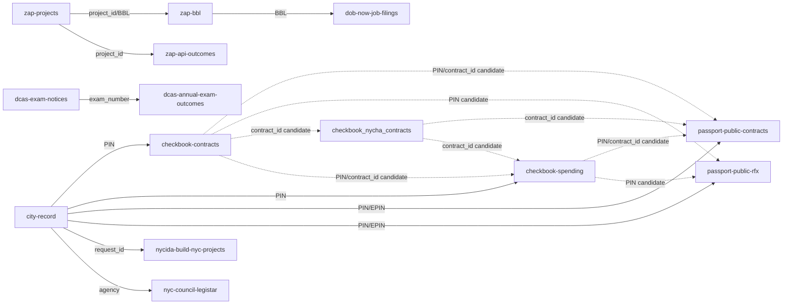

<!-- Generated by tools/depot_rederive.mjs from site/data/gap_taxonomy.json. Do not edit by hand. -->

# Lifecycle gap taxonomy

When a lifecycle slot is empty, the reader must see **which kind of gap** it is.

| Class | Register | Meaning |
|---|---|---|
| **not_yet_ingested** (a) | “Not yet shown here — … live in *source*.” | A public source publishes this field. Empty means incomplete join or missing adapter. |
| **not_published** (b) | “The city does not publish this — it would appear in *where* if released.” | No public, joinable release is known. Name the logical home when one exists. |

Operational messages (source unreachable, ambiguous multi-match) stay outside this taxonomy.

The executable inventory is [`site/data/gap_taxonomy.json`](../site/data/gap_taxonomy.json).
The **depot** is the join graph in that file (`sources` + `crosswalks`), not the gap list alone.
Refresh with `node tools/depot_rederive.mjs` after any source-contract or taxonomy change.

## Inventory summary

| Gap | Class | Public home or “would appear in” |
|---|---|---|
| contract lifecycle · pending stage | a | Checkbook NYC Contracts |
| contract lifecycle · registered stage | a | Checkbook NYC Contracts |
| contract lifecycle · payment stage | a | Checkbook NYC Spending |
| contract lifecycle · provenance when PIN missing | b | Checkbook NYC registrations and payments (joined by PIN) if the notice published a Procurement ID |
| contract lifecycle · tender documents (not yet a separate slot UI) | a | PASSPort Public solicitations (RFx) |
| OCDS tender/numberOfTenderers · contestability package | a | Bid Tabulations (Historical) |
| award detail enrichment beyond City Record | a | Recent Contract Awards (OCP) |
| OCDS planning/budget and planning/rationale | b | agency budget justifications or MOCS procurement plans if released as stable machine data |
| subsidy lifecycle · per-stage empty slot | a | NYCIDA/Build NYC public documents |
| subsidy lifecycle · stage outcome | b | Build NYC / NYCIDA project documents (board minutes, closing packages) if an explicit outcome field is released |
| subsidy lifecycle · no project join | b | NYCIDA/Build NYC financial public documents page if a project record is released for the notice |
| subsidy lifecycle · company / place / money fields | b | the linked Build NYC project record if those fields are filled on publication |
| Council meeting outcomes · no event join | a | NYC Council Legistar API |
| Council meeting outcomes · matter without votes | a | NYC Council Legistar votes |
| Council meeting outcomes · event without agenda matters | a | NYC Council Legistar agenda items |
| non-Council hearings · votes | b | community board or borough president open data / Legistar-class feeds if released as machine-readable votes |
| staffing exam cards · post-cycle outcomes | a | DCAS annual civil-service exam outcome aggregates |
| per-applicant exam results | b | DCAS candidate portals only if individual results were released as public open data (they are not) |
| staffing exam card · fee or salary null | b | the Notice of Examination PDF / open-competitive schedule if DCAS states the amount |
| agency awards empty state · verified absent | b | NYS Authorities Budget Office procurement filings or Checkbook NYC if that agency released a joinable open dataset |
| notice external-award empty after ABO check | a | NYS Authorities Budget Office procurement datasets |
| land / ZAP · final decision documents beyond status | a | Zoning Application Portal projects |

## Join graph (sources)

| Source | Status | Join keys | Predicted grade | Realized coverage |
|---|---|---|---|---|
| `abo-local-authorities` | landed | authority_name, vendor_name, award_date, contract_amount | — | — |
| `bid-tabulations-historical` | disabled | bid_number, PIN, bid_title, bid_opening_date | high-risk | 0% (modern_notices_strict) |
| `checkbook-contracts` | landed | PIN, contract_id, registration_date | — | — |
| `checkbook-nycha-contracts` | landed | contract_id | — | — |
| `checkbook-spending` | landed | PIN, contract_id, check_amount, check_date | — | — |
| `city-record` | live-only | PIN, request_id, agency | — | — |
| `current-solicitations-ocp` | not_ingested | PIN, request_id, agency | — | — |
| `dcas-annual-exam-outcomes` | landed | exam_number | medium | — |
| `dcas-exam-notices` | landed | exam_number | — | — |
| `dob-now-job-filings` | live-only | BBL, BIN, job_number | — | — |
| `legacy-dob-job-filings` | live-only | BBL, BIN, job_number | — | — |
| `mappluto` | live-only | BBL | — | — |
| `nyc-council-legistar` | landed | matter_id, event_id, event_item_id, agency, event_title, start_time | — | — |
| `nyc-rules-rss` | landed | agency | — | — |
| `nycida-build-nyc-projects` | landed | request_id, project_id, project_name, company_name, project_address, request_id_when_present | — | — |
| `passport-public-contracts` | landed | EPIN, PIN, contract_id, agency | high-risk | 74% (all_notices_to_contracts) |
| `passport-public-rfx` | landed | EPIN, PIN, procurement_name, agency | high-risk | 78% (either_contracts_or_rfx) |
| `recent-contract-awards-ocp` | not_ingested | PIN, request_id, agency | — | — |
| `unregistered-zoning-application-portal-projects` | not_ingested | project_id, BBL, ulurp_numbers | — | — |
| `zap-api-outcomes` | landed | project_id, BBL, ulurp_numbers | — | 100% (ulurp_complete_useful_outcome) |
| `zap-bbl` | live-only | BBL, project_id | — | — |
| `zap-projects` | live-only | project_id, BBL, ulurp_numbers | — | — |

## Materialized crosswalks

| Crosswalk | Pair | Key path | Realized rate |
|---|---|---|---|
| `city-record-pin-x-checkbook-contracts` | `city-record` × `checkbook-contracts` | PIN | — |
| `city-record-pin-x-checkbook-spending` | `city-record` × `checkbook-spending` | PIN | — |
| `city-record-pin-x-passport-contracts-epin` | `city-record` × `passport-public-contracts` | PIN · EPIN | 74% |
| `city-record-pin-x-passport-rfx-epin` | `city-record` × `passport-public-rfx` | PIN · EPIN | 44.4% |
| `city-record-request-x-nycida-projects` | `city-record` × `nycida-build-nyc-projects` | request_id | — |
| `city-record-x-legistar-events` | `city-record` × `nyc-council-legistar` | agency | — |
| `exam-number-x-dcas-outcomes` | `dcas-exam-notices` × `dcas-annual-exam-outcomes` | exam_number | — |
| `zap-bbl-x-dob-now-filings` | `zap-bbl` × `dob-now-job-filings` | BBL | 56% |
| `zap-project-x-bbl` | `zap-projects` × `zap-bbl` | project_id · BBL | — |
| `zap-projects-x-zap-api-outcomes` | `zap-projects` × `zap-api-outcomes` | project_id | 100% |

## Candidate crosswalks (worth materializing?)

| Candidate | Pair | Key path | Verdict | Gaps |
|---|---|---|---|---|
| `checkbook-contracts-x-passport-public-contracts-via-PIN+contract_id` | `checkbook-contracts` × `passport-public-contracts` | PIN · contract_id | yes | 6 |
| `checkbook-contracts-x-passport-public-rfx-via-PIN` | `checkbook-contracts` × `passport-public-rfx` | PIN | yes | 6 |
| `checkbook-nycha-contracts-x-passport-public-contracts-via-contract_id` | `checkbook-nycha-contracts` × `passport-public-contracts` | contract_id | yes | 6 |
| `checkbook-spending-x-passport-public-contracts-via-PIN+contract_id` | `checkbook-spending` × `passport-public-contracts` | PIN · contract_id | yes | 6 |
| `checkbook-spending-x-passport-public-rfx-via-PIN` | `checkbook-spending` × `passport-public-rfx` | PIN | yes | 6 |
| `checkbook-contracts-x-current-solicitations-ocp-via-PIN` | `checkbook-contracts` × `current-solicitations-ocp` | PIN | maybe | 4 |
| `checkbook-contracts-x-recent-contract-awards-ocp-via-PIN` | `checkbook-contracts` × `recent-contract-awards-ocp` | PIN | maybe | 4 |
| `checkbook-spending-x-current-solicitations-ocp-via-PIN` | `checkbook-spending` × `current-solicitations-ocp` | PIN | maybe | 4 |
| `checkbook-spending-x-recent-contract-awards-ocp-via-PIN` | `checkbook-spending` × `recent-contract-awards-ocp` | PIN | maybe | 4 |
| `checkbook-contracts-x-checkbook-nycha-contracts-via-contract_id` | `checkbook-contracts` × `checkbook-nycha-contracts` | contract_id | yes | 3 |
| `checkbook-contracts-x-checkbook-spending-via-PIN+contract_id` | `checkbook-contracts` × `checkbook-spending` | PIN · contract_id | yes | 3 |
| `checkbook-nycha-contracts-x-checkbook-spending-via-contract_id` | `checkbook-nycha-contracts` × `checkbook-spending` | contract_id | yes | 3 |
| `city-record-x-current-solicitations-ocp-via-PIN+request_id` | `city-record` × `current-solicitations-ocp` | PIN · request_id | maybe | 2 |
| `current-solicitations-ocp-x-nycida-build-nyc-projects-via-request_id` | `current-solicitations-ocp` × `nycida-build-nyc-projects` | request_id | maybe | 2 |
| `current-solicitations-ocp-x-passport-public-contracts-via-PIN` | `current-solicitations-ocp` × `passport-public-contracts` | PIN | maybe | 2 |
| `current-solicitations-ocp-x-recent-contract-awards-ocp-via-PIN+request_id` | `current-solicitations-ocp` × `recent-contract-awards-ocp` | PIN · request_id | maybe | 2 |
| `nycida-build-nyc-projects-x-recent-contract-awards-ocp-via-request_id` | `nycida-build-nyc-projects` × `recent-contract-awards-ocp` | request_id | maybe | 2 |
| `nycida-build-nyc-projects-x-unregistered-zoning-application-portal-projects-via-project_id` | `nycida-build-nyc-projects` × `unregistered-zoning-application-portal-projects` | project_id | maybe | 2 |
| `nycida-build-nyc-projects-x-zap-api-outcomes-via-project_id` | `nycida-build-nyc-projects` × `zap-api-outcomes` | project_id | yes | 2 |
| `nycida-build-nyc-projects-x-zap-bbl-via-project_id` | `nycida-build-nyc-projects` × `zap-bbl` | project_id | yes | 2 |

## Graph view



## Ranked class-(a) ingest list

Ordered for dispatch. Full rows (effort, join risk, value scores) live in
`site/data/gap_taxonomy.json` → `ranked_ingest_list`.

1. **PASSPort Public contracts + solicitations** — procurement-pending-unmatched, procurement-registered-unmatched, procurement-solicitation-documents. Measured join **78%**. Predicted grade: **high-risk**. Measured 78% either-source EPIN↔PIN on PIN-bearing Procurement notices since 2025-01-01 (predicted pre-landing grade: high-risk). Medium — stable dataJs machine path; strict EPIN↔PIN join measured 78% either-source on PIN-bearing Procurement notices since 2025-01-01.
2. **Legistar agenda/vote materialization depth** — meeting-outcomes-unmatched, meeting-votes-absent, meeting-matters-absent.
3. **ZAP decision docs + DOB NOW outcome stitch** — land-outcome-detail. Measured join **100%**.
4. **DCAS annual exam outcomes → exam card join** — exam-outcome-aggregate.
5. **Current Solicitations Open Data 3khw-qi8f** — procurement-solicitation-documents.
6. **Recent Contract Awards Open Data qyyg-4tf5** — procurement-ocp-recent-awards.
7. **Doing Business Search Entities 72mk-a8z7** — secondary enrichment.
8. **Bid Tabulations Historical 9k82-ys7w** — procurement-bid-counts. Measured join **0%**. Predicted grade: **high-risk**. High — measured strict join 0% on modern notices (2025+), 9.07% on 2016-2021 overlap; no PIN column; openings end 2021-03-24. Contracted as disabled (bid-tabulations-historical). Measured — recon complete; materialization stopped below usefulness threshold.

## Verification notes (2026-07-30)

- Open Data views 3khw-qi8f, qyyg-4tf5, 9k82-ys7w, 72mk-a8z7 returned live metadata.
- PASSPort Public contracts and rfx pages returned HTTP 200.
- City Record type counts since 2025-01-01: Award ~5173, Solicitation ~1550, Public Hearings ~1679, Intent to Award ~703.
- EDC document portal may block unattended fetch (403); product already treats it as HTML source.
- Bid Tabulations Historical 9k82-ys7w join recon (2026-07-30): strict PIN↔bid_number 0% modern / 9.07% historical overlap; below ~30% usefulness; source contract disabled without materialization.

## UI copy keys (two registers)

Class **a** keys use the “Not yet shown here” register with per-slot specificity (pending vs registered vs payments vs votes vs subsidy stages).

Class **b** keys use the “The city does not publish this” register with a concrete “would appear in …” pointer.

Operational keys unchanged: `lifecycle_unknown_html`, `lifecycle_ambiguous_html`, `subsidy_source_unavailable_html`.

## Depot refresh

```sh
node tools/depot_rederive.mjs          # write registry + docs + receipt
node tools/depot_rederive.mjs --check  # CI drift gate (no writes)
```

Last refresh fingerprint: `21f733186544…` · materialized 10 · candidates 44 · class changes 0.
